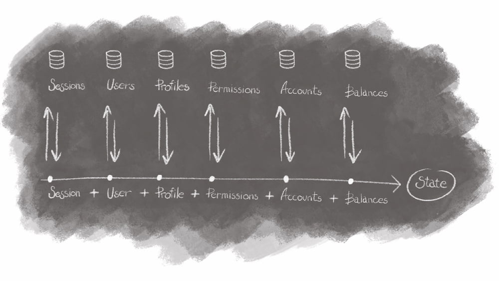
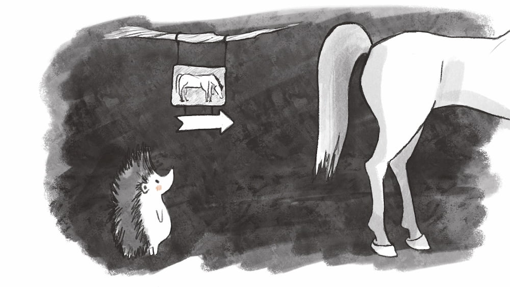
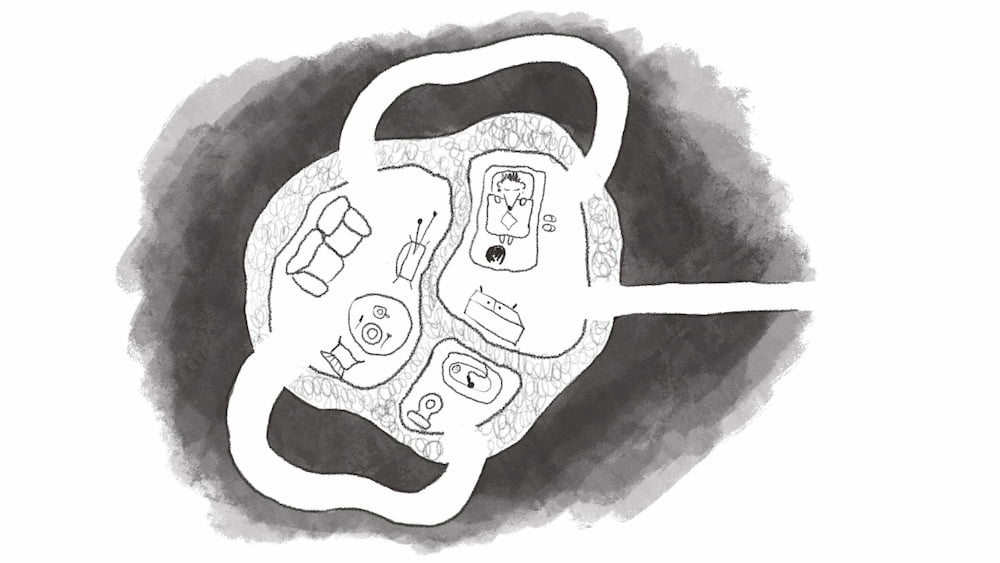

<p class="paragraph--lead">
  So you are building a client-side web app for that next big project and wondering: “Which router should I use?”. Here is the thing: you don’t need any, and you will understand why shortly.
</p>

## What is routing?

The first interface for a user to access any website is their browser address bar. Even if your website is visited via a link or from bookmarks, for a user it still goes through the address bar. Change of the address leads to a change of the page.

Our application needs to determine from that URL which screen and in what state to show to the user.

<figure>
  
  <figcaption>“One step away” by <a href="https://t.me/anna_zarubey">Anna Zarubey</a></figcaption>
</figure>

So, in a nutshell, routing is deriving the state from the input URL. Yes, that simple.

## Why is routing difficult then?

When we scale our app, we split the state into many pieces. There are two reasons to do it:

1. it helps to avoid cognitive overload;
2. it allows sharing the workload between several team members.

Usually, we don’t need all the pieces at once, so we put them to different endpoints and storages. When a user opens the app, we reconstruct the required state from little pieces scattered all over the system. Moreover, some of the state pieces determine which subset of other pieces should be restored.

<figure>
  
  <figcaption>Example state reconstruction scheme, drawing by <a href="https://t.me/anna_zarubey">Anna Zarubey</a></figcaption>
</figure>

Sometimes state reconstruction is simple. For example, when a user requests the login page, we should just give them the login page. Most of the time, though, this logic is a lot more complex, depending on the current context, system state, and business requirements.

The question is how much of this logic should we own, and how much could we generalize and delegate to routing via a framework or a library?

Naturally, we would prefer to delegate as much code as possible. There are different approaches to that. One of them would be to fully separate routing and business logic.

For instance, we could match a path to some handler function and pass query parameters to it. Then it will decide how to restore the state and what to show to the user.

It could look like this (🔀 is for routing, 🅱️️ is for business logic, ❇️ is for dependencies loading):

```
🔀 Receive request path with parameters in it
    🔀 Determine handler for this path and separate parameters
        ❇️ Load user session
            🅱️ Check if the user is authenticated
        ❇️ Load user profile
            🅱️ Check if the user is authorized to use this handler
        ❇️️ Load the first item from the path with parameter
            🅱️ Check if it exists
            🅱️ Check if the user is authorized to use it
        ❇️️ Load the second item from the path with parameter
            🅱️ Check if it exists
            🅱️ Check if it is relevant to the first item
            🅱️️ Check if the user is authorized to use it
        🅱️️ ... (Other business logic)
    🔀 Return the combined result
```

After a while, we will notice that most of these handlers mainly consist of the same instructions — session loading and authentication check, for instance. Maybe we could separate all these checks into another layer to stop repeating the same thing all over again?

Paths are hierarchical by design, which can be used to simplify our code. Like, we can agree that all the authenticated paths start with `/user` — meaning we could match paths from left to right and apply different checks depending on where we are in the hierarchy right now.

Welcome to the concept of Routing Middleware. It is still business logic, but it also can’t be separated from paths structure. So it is still routing too.

Both routing and business logic? Too complicated! We wanted a clear separation to delegate as much routing code as possible. Instead, we got the opposite. Screw middleware then. Why don’t we just define the list of all the checks and dependencies for each route?

That would work, but we still need to provide context for those. For authentication and handler authorization it’s quite straightforward — we can identify the user from the named cookie passed in the request context. But what about data availability and access control? Do we need to invent an additional language to extract ids from the path? Or do we need to always name those ids in some way consistent with the list of checks?

We also want to optimize things, so we need to define sequences or relations for dependencies loading and checks. And some of them could be done in parallel — that should be defined too. Do we need one more language? Or do we do it imperatively? Then how is it different from middlewares?

These questions make routing such a difficult task.

Should it be so hard, though? Maybe backend already solved all the problems, and frontend should repeat after it’s elder brother? It already does, but there are multiple important obstacles along the way.

## How is frontend routing different from backend routing?

First, **we usually can’t have all the logic on the client-side**: data is stored on a remote server, and we need to check if data is still valid to perform the desired transition. An observant reader will note that the same problems exist on the backend: database requests are asynchronous. The problem is: asynchronous nature of data requests is conflicting with the synchronous nature of the core concept of the web — links.

By saying links are synchronous, I don’t mean they transfer you immediately to your target, rather that they don’t require writing any asynchronous javascript. The web platform already handles the links for us.

This takes us to the second point. **We need to entertain users while they are waiting**. Modern web apps try to behave more like native apps rather than websites of the past. To make transitions smooth and seamless, we handle link clicks with javascript implementing from scratch all the logic provided by the platform.

User falls for this little deception and assumes that all the required resources are already on their device, so there is no need to load the whole page from the server — it can be just shown. It could be a smooth transition, or skeleton UI, or just plain old loader — in any case, we need to show something immediately after user interaction. On the contrary, waiting for a response from the backend is handled by the platform.

Third, **client-side logic requires request chains**. We have to ask the server for the first data chunk, then decide to load one of the next chunks depending on the first, then load all the items from the list in the second chunk... Only after a long chain of async requests we finally can make the transition.

The backend also has dependent data requests, but they could be optimized with stored procedures or JOIN queries. The only attempt to do something similar for the frontend is GraphQL, but it comes with a lot of disadvantages (which are out of the scope of this article).

And the last one — on the frontend, we sometimes have **virtual routes**, meaning we have different screen states for the same path. Because, well, you filled the first two steps of that wizard form — so we need to show you the third one and not allow you to go to the fourth one.

## Why none of the popular routers solve the problem?

For some unknown reason, most of the popular routing solutions for web frontend focus on the tip of the iceberg, while making some significant mistakes in core architecture design.

### Mistake #1: defining routes in the view layer

<figure>
  
  <figcaption>“Off-label” by <a href="https://t.me/anna_zarubey">Anna Zarubey</a></figcaption>
</figure>

As you already know, the routing process is heavily dependent on business logic. The only two cases when routing and view should collide are mapping resolved state to page and rendering links.

So there is no actual reason to use your view logic for routes definition. And when you do something without cause, you make your code difficult to understand and maintain.

It still works quite well on small apps, though, because they don’t have any complex or asynchronous business logic, and the only thing they need is a list of route-page pairs.

### Mistake #2: routing as a simple mapping from paths to pages

<figure>
  
  <figcaption>“Obvious” by <a href="https://t.me/anna_zarubey">Anna Zarubey</a></figcaption>
</figure>

Some routers selling point is the declarative style of routes definition. Meaning the whole routing problem is just a key-value dictionary.

No, it’s not. It could be, but only in simple hello-world-ish cases, which get complex as soon as your app becomes one month old.

In general, it is a fully-fledged process with dependency loading, data processing, and decision-making. It is also full of side effects: from external dependencies and data loading to browser history management.

### Mistake #3: immediate transitions

Let’s assume you are on a simple website with no javascript at all. When you click the link, are you immediately transitioned to your destination? No, even in this simple case, you have to wait until the next page is loaded.

Waiting for transitions is in the DNA of the web from day one. We got used to waiting after clicking the link, and we **expect the next page to be loaded**. This means it’s ok to wait because I requested my entire friend list, and that’s a lot of data, and I’m on 2G internet in the middle of nowhere, so I totally understand.

A router should allow to transition out of the page, handle waiting time, then transition to the next page. That’s what browsers already do with websites, and the least we can do is not break it.

### Mistake #4: no place for dependencies or common behavior

<figure>
  
  <figcaption>“Ever-ready” by <a href="https://t.me/anna_zarubey">Anna Zarubey</a></figcaption>
</figure>

It is generally a combination of #2 and #3 but feels like something to be addressed explicitly.

Routers tend to work with pages as if the app already has everything it needs to display every page. And that may be true for a calculator, or some mini-game.

In reality, we have network-heavy applications, which require both data loading and a lot of javascript and styles to display it. And most of the users won’t even visit that one heavy page. So the most logical solution is to separate its resources from the rest of the app.

Now if we are going to separate that page, we have to put all the preconditions and dependencies inside of the page itself, but is it really where they belong? Also: do you enjoy repeating “if no user is authorized, redirect to login” for every page?

### Mistake #5: one and only one path for every page

<figure>
  
  <figcaption>“Next room is outside” by <a href="https://t.me/anna_zarubey">Anna Zarubey</a></figcaption>
</figure>

There is a stable <abbr title="User experience">UX</abbr> trend to split long forms into multiple steps called “form wizards”. If you aim for the good UX, you would usually prefer to add those steps to browser history. It will allow the user to navigate between form steps with browser buttons.

Sounds like a natural feature, right? But you can’t implement it with basic router functionality. You will need to push those steps to browser history manually. The router will still listen to history events, so you will need to find a workaround to ignore them. Or you could just specify service paths that are accessible only if the wizard is in a relevant state. Meaning users will share links to various wizard steps, and you will also need to check if they are allowed to go there directly.

You would presume routers don’t support this because there are some browser limitations. Well, actually, there is none: you can push the next history state without route change, but with another data.

Routers also don’t allow storing modal dialogs state. It leads either to hacks like allocating a specific path to each dialog or dialogs management without router at all.

Some routers even forbid mixing [pathnames](https://developer.mozilla.org/en-US/docs/Web/API/URL/pathname) and [hashes](https://developer.mozilla.org/en-US/docs/Web/API/URL/hash), while fragments (defined by hashes) are the vital part of the web platform and are the perfect fit for the use case of virtual routing. Which literally is rendering of different fragments of the same page depending on current data state.

Yes, you guessed it correctly: virtual routing cannot be implemented because routers assume you only have plain mapping (see #2).

## What should we do then?

All this sounds awful. What should we do to solve our routing problem in a simple, maintainable, and scalable way without going crazy in the meantime? I’m glad you asked.

1. You still need to deserialize the state from the path and serialize it back. Many libraries do it just fine. For instance, you can check [path-to-regexp](https://github.com/pillarjs/path-to-regexp) (used by react-router and page.js), [path-parser](https://github.com/troch/path-parser) (used by router5), or [route-parser](https://github.com/rcs/route-parser). You also need to put that state into browser history (or sometimes not), and there is [history.js](https://github.com/browserstate/history.js/) lib for you, but you should probably just use [Browser History API](https://developer.mozilla.org/en-US/docs/Web/API/History_API) — it is in a good and consistent state across all major browsers right now.
2. You need to add asynchronous dependencies check, which consists of additional script loading and data requests. Usually, this is what your controller handles already: redux-thunk, redux-saga, mobx, effector — whatever you prefer. If it handles your async logic, it could handle your async dependencies management.
3. While the transition is happening, you need to know some meta info about it. It’s always different, so you can just save whatever structure you prefer to your state manager. In most cases, the basics you would like to know are the current screen, the next screen, and the transition state.
But you could also store loading progress, all intermediary transitions (or redirects), additional context to help with the transition, scroll position, cause of transition, etc.
Your state manager can store all that data with ease and keep it accessible for the business logic mentioned above.
4. You need to render the screen. In a simple case, you need to choose a component by name and render it. In a more complex case, you could choose a component and all the modal screens depending on your business logic. Anyway, that’s the only reason for your view library to exist, so use it!

That’s it. You got the path, got dependencies for it, stored the meta info, and finally rendered the page. **No router was harmed along the way.**

## Conclusion

It is extremely hard to build a general routing solution because of its high coupling with business logic and libraries used to define business logic.

Of course, if you don’t have business logic or put your business logic into the view layer, you will be fine with current solutions. But if you are building for the long term, putting your logic into view is neither maintainable nor scalable. Yes, separating model and view still is a thing.

There are some experimental projects though trying to treat routing as a process and mix it with state management. That could be a good angle to view this problem.

For example, [universal-router](https://www.kriasoft.com/universal-router/) resolves routes to actions that are fully capable of downloading requirements and deriving the current view state. It also allows you to pass any context to the action and return data of any type from that action. This, in turn, allows different approaches to business logic integration. You can inject your state and methods into the router and hand over control to it while the transition is happening. Or you can inject dependencies on action call, wait for the resolution, then continue with the business logic depending on the results. Still, its concept of middlewares is too simple, and it lacks community support and development predictability with at least some basic roadmap.

But why use any libraries, if routing can be so dead-simple when you do it in business logic?

So for now — you just don’t need a router.
