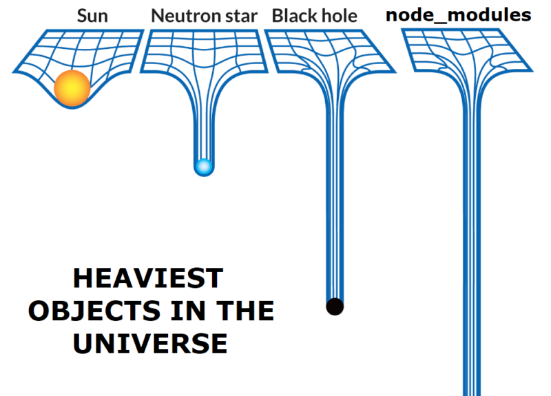

  Hardly any front-end projects are built without external dependencies. And when it comes to choosing dependencies, you’d better make concious and informed decisions, since bad choice can lead to worsened <abbr title="User experience">UX</abbr> and even legal consequences. In this article we’ll look into a few tools that’ll help you make those decisions better.

## Package discovery

The default search experience on [npmjs.com](https://www.npmjs.com) can sometimes be frustrating. For example, searching for [couchdb promise](https://www.npmjs.com/search?q=couchdb+promise) and [couchdb promises](https://www.npmjs.com/search?q=couchdb+promises) produces different search results, missing some packages for the second query.

[npms](https://npms.io) aims to provide a better search experience by enabling advanced Elasticsearch features and using a unique package ranking system.

## Package dependencies analysis

It might be a good idea to check what transitive dependencies you’ll get along with the package you are considering using. Particularly interesting aspects to look into include:

* licenses that are not suitable for your project
* the total count of dependencies and the total count of it’s maintainers (usually, more is worse)

There are two quite similar tools for such analysis: [npm.anvaka.com](https://npm.anvaka.com) and [npmgraph](https://npmgraph.js.org). The first produces nicer visualizations, while the second allows you to upload the entire `package.json` for bulk analysis of your project’s dependencies.

## Package size on disk and in bundle

You’ve probably seen those memes about `node_modules`, and let’s be honest, the meme is fun, but the situation is scary:

When it comes to package size, there are two things to consider:
* *install size*, the amount of bytes it takes on the developer’s disk after installation
* *bundle size*, the amount of bytes it takes in the final application bundle sent to the user

Install size affects developer experience and <abbr title="Continuous integration">CI</abbr> build time and resources, whereas bundle size affects user experience.

[Packagephobia](https://packagephobia.com) is a great tool for checking install size.

[Bundlephobia](https://bundlephobia.com) and [bundlejs](https://bundlejs.com) let you check how a package will affect bundle size. Bundlephobia is the first-of-its-kind tool with no fancy features, while bundlejs is newer and more advanced tool that can treeshake and bundle multiple packages (both CommonJS and ESM) together locally in your browser, showing you the total bundle size of those.

## Package source exploration

Sometimes you might want to explore the contents of the published package. For instance, to check that published code does exactly what it claims to do, and doesn’t include anything potentially harmful or unexpected. You might also want to check the diff between two versions of the package to see if the new version includes the bugfix you are interested in (because sometimes changelogs lie) or to make a security audit.

[npmfs](https://npmfs.com) is the right tool for these jobs: it supports viewing the contents of packages, comparing packages across versions, linking to specific lines in files and diffs, and even downloading any file or folder inside a package.
