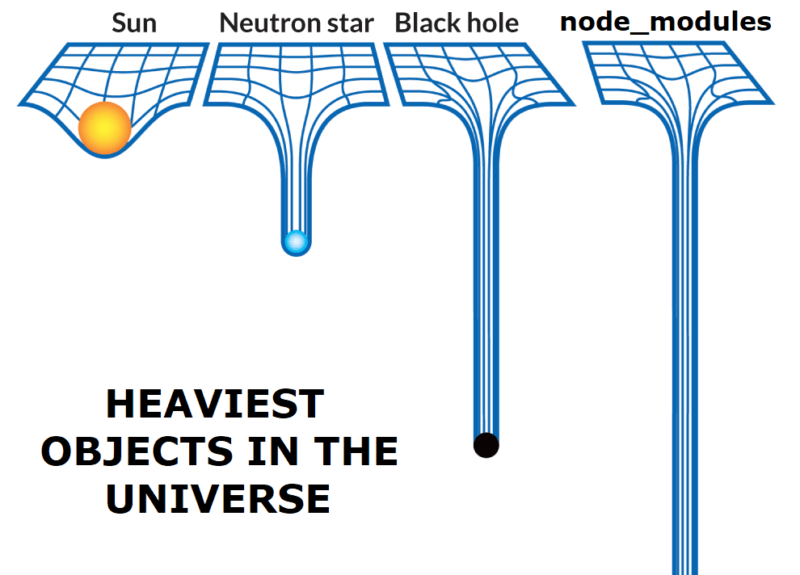

  Немногие фронтенд-проекты обходятся без внешних зависимостей. Выбор зависимостей должен быть осознанным и вдумчивым процессом: неудачные решения могут привести к ухудшению <abbr title="User experience">UX</abbr> и даже юридическим последствиям. В этой статье мы рассмотрим несколько инструментов, которые помогут вам с выбором зависимостей.

## Поиск пакетов

Поиск пакетов на [npmjs.com](https://www.npmjs.com) работает не лучшим образом. Например, поиск по запросам [couchdb promise](https://www.npmjs.com/search?q=couchdb+promise) и [couchdb promises](https://www.npmjs.com/search?q=couchdb+promises) выдаёт разные результаты.

Сервис [npms](https://npms.io) стремится решить проблему поиска благодаря использованию продвинутых возможностей Elasticsearch и уникальной системе ранжированя пакетов.

## Анализ зависимостей пакетов

Не лишним будет проверить транзитивные зависимости, которые попадут в ваш проект вместе с пакетом, который вы планируете использовать. Особенное внимание стоит обратить на:

* лицензии, не подходящие вашему проекту
* общее количество зависимостей и их мейнтейнеров (обычно чем больше зависимостей, тем хуже)

Для такого анализа есть два довольно похожих сервиса: [npm.anvaka.com](https://npm.anvaka.com) и [npmgraph](https://npmgraph.js.org). Первый сервис генерирует более красивую визуализацию, а второй позволяет целиком загрузить ваш `package.json`, чтобы сразу проверить все уже добавленные пакеты.

## Размер пакета на диске и в бандле

Наверняка вы видели мемы о размере `node_modules`. Будем честны: мем смешной, а ситуация страшная.

Когда речь заходит о размере пакета, есть два аспекта:
* *install size*, размер установки: количество байтов, занимаемое пакетом на машине разработчика после установки
* *bundle size*, размер бандла: количество байтов, занимаемое пакетом в конечном бандле приложения, который скачивается браузерами пользователей

Размер установки влияет на удобство разработки, время сборки и утилизацию ресурсов в <abbr title="Continuous integration">CI</abbr>. Размер бандла влияет в первую очередь на пользовательский опыт.

Через [Packagephobia](https://packagephobia.com) можно проверить размера установки пакета.

Через [Bundlephobia](https://bundlephobia.com) и [bundlejs](https://bundlejs.com) можно проверить, как пакет повлияет на ваш бандл. Bundlephobia — первый инструмент подобного рода, без каких-либо особенных фич. Bundlejs — новый и гораздо более продвинутый инструмент, поддерживающий тришейкинг, сборку нескольких пакетов одновременно, и более тонкую настройку бандлинга.

Наконец, самый новый из всех сервис [pkg-size](https://pkg-size.dev) позволяет сразу проверить и размер установки, и размер бандла для выбранного пакета.

## Исследование содержимого пакета

Иногда может понадобиться заглянуть внутрь опубликованного пакета. Например, чтобы убедиться, что опубликованный код делает ровно то, что должен, и не включает ничего неожиданного и потенциально опасного.

Также иногда бывает полезно проверить разницу между двумя версиями пакета, чтобы убедиться в наличии нужного исправления бага (иногда ченджлоги врут) или провести аудит безопасности при обновлении зависимостей.

Сервис [npmfs](https://npmfs.com) — подходящий для этих задач инструмент: он поддерживает просмотр содержимого пакета, сравнение версий пакета, ссылки на конкретные строки кода и диффы, а также скачивание любых файлов или целых директорий из пакета.

Просто посмотреть содержимое пакета также можно через сервис [unpkg](https://unpkg.com), но это не его основное предназначение.
