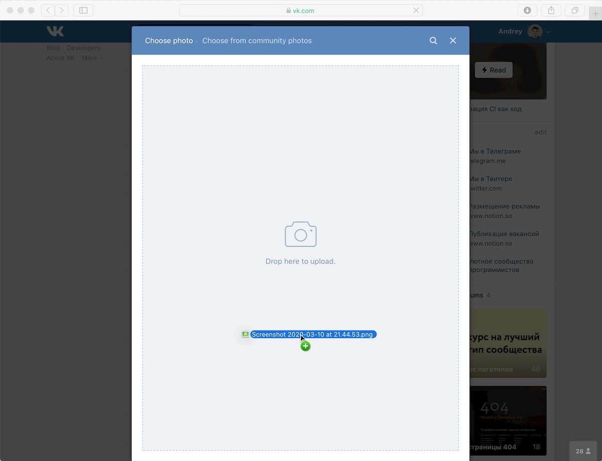

<p class="paragraph--lead">Одна из повседневных задач каждого фронтендера — загрузка данных с сервера. На время загрузки обычно требуется показывать пользователю спиннер, а в случае неудачи — сообщение об ошибке.</p>

В коде состояние загрузки часто описывают булевыми флагами:

```javascript
const comments = {
  isLoading: false,
  isLoaded: false,
  isError: false,
  errorText: '',
  data: [],
};
```

На первый взгляд такие флаги выглядят удобно. При их использовании код загрузки данных выглядит примерно так:

```javascript
const comments = {
  isLoading: false,
  isLoaded: false,
  isError: false,
  errorText: '',
  data: [],
};

function loadComments() {
  comments.isLoaded = false;
  comments.isError = false;
  comments.isLoading = true;

  fetch('/comments')
    .then((response) => response.json())
    .then((data) => {
      comments.isLoading = false;
      comments.isLoaded = true;
      comments.data = data;
    })
    .catch((error) => {
      commments.isLoading = false;
      comments.isError = true;
      comments.errorText = error.message;
    });
}
```

Получается запутанно и многословно. Нужно внимательно следить, значения каких флагов следует сбросить, иначе в вашем приложении появятся бессмысленные комбинации флагов вроде `isLoading: true` и `isLoaded: true`.

Более практичный подход, решающий эту проблему — описание состояния одним полем `dataState` и автоматическое вычисление флагов на основе значения этого поля.

Часто размеры области, на которую нужно бросить перетаскиваемый файл, ограничивают:

<figure>
  
  <figcaption>Скриншот сайта «ВКонтакте» в момент перетаскивания файла</figcaption>
</figure>

Если поле загрузки файлов всего одно, такое ограничение обосновать сложно, а пользователю оно мешает: чем меньше доступная область, тем сложнее пользователю в неё попасть и тем проще промахнуться.
