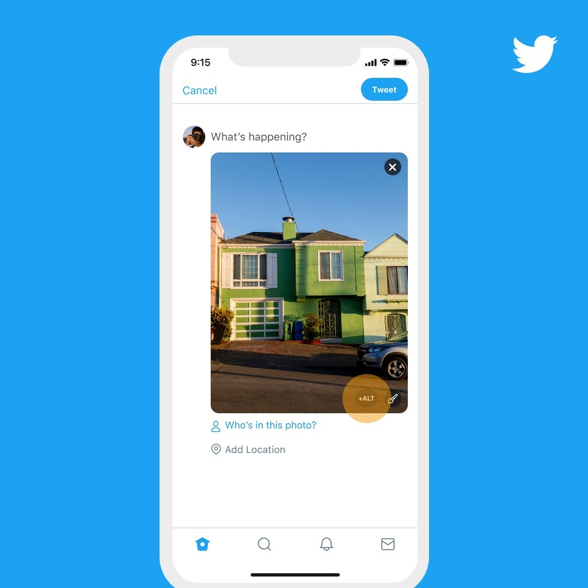
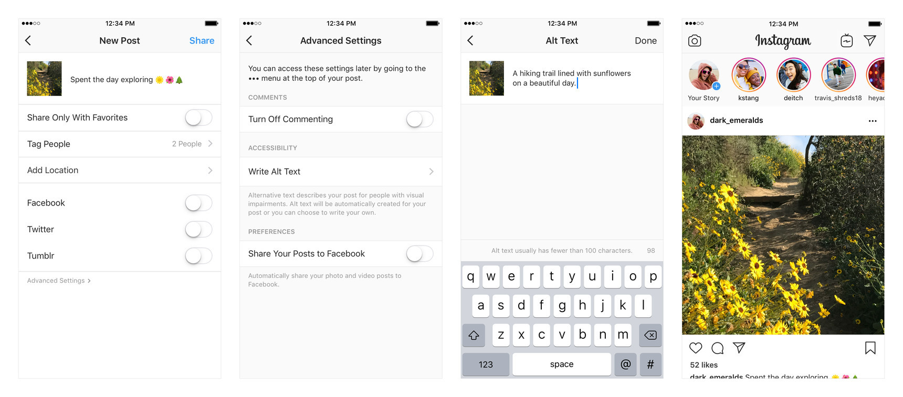

27 мая 2020 инженеры Twitter [сообщили](https://twitter.com/TwitterA11y/status/1265689579371323392), что теперь возможность задания альтернативного описания для изображений доступна всем пользователям. Раньше эта возможность была по умолчанию выключена и включалась через настройки.

В связи с этим вспоминается Instagram, который по умолчанию генерирует альтернативное описание автоматически, используя компьютерное зрение для определения содержимого изображения. Возможность задать собственное альтернативное описание в Instagram также присутствует, но она спрятана от пользователя:

